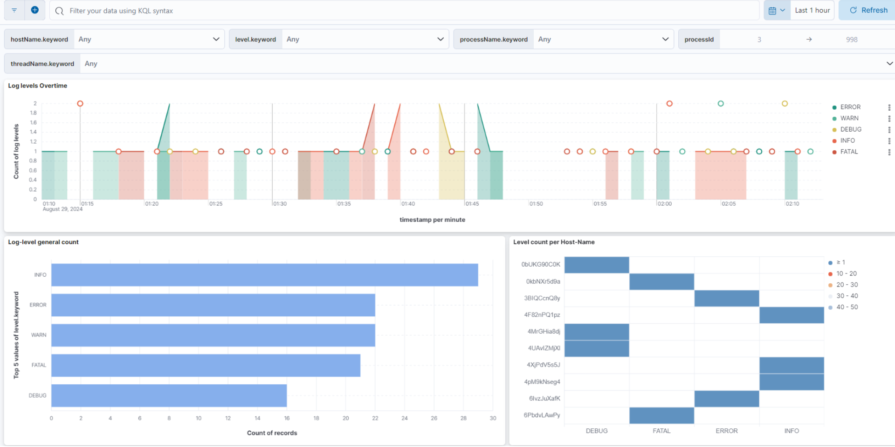
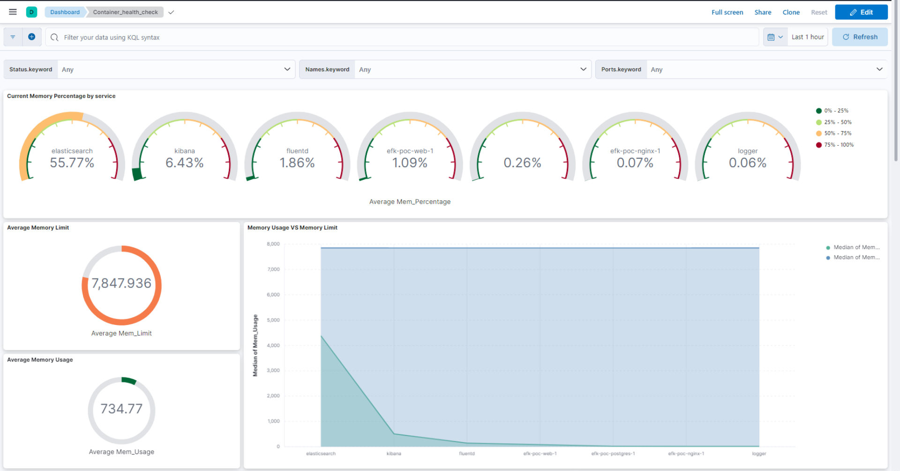

# LOGS TRACE ET OPTIMISATION - REFCONTACT-EFK

## Aperçu du projet
Le projet REFCONTACT-EFK vise à développer une solution intégrée pour gérer efficacement les logs générés d'une multitude de services interconnectés au sein du projet REFCONTACT. Ces services, qui sont essentiels au fonctionnement global du système, produisent un volume important de données de log, indispensables pour surveiller les performances, diagnostiquer les problèmes, et améliorer continuellement l'ensemble de l'écosystème.

Le projet repose sur une architecture qui centralise les logs à l'aide de Fluentd, les stocke dans Elasticsearch, et les visualise via Kibana. Cette approche permet non seulement de structurer et d'analyser les logs de manière cohérente, mais aussi de fournir des tableaux de bord interactifs et dynamiques pour une meilleure compréhension des données.

L'un des objectifs principaux de REFCONTACT est de surmonter la complexité inhérente aux interactions entre les services, en offrant une visibilité complète et en temps réel sur l'état du système.
### Fonctionnalités clés
- Collecte et stockage centralisés des logs
- Surveillance en temps réel de la santé des services
- Tableaux de bord personnalisés pour visualiser les données de logs et les métriques des services
- Authentification des utilisateurs et contrôle d'accès pour visualisation et modification
- Alertes par e-mail pour les seuils d'utilisation des ressources

## Technologies utilisées
1. **Fluentd** : Fluentd est un collecteur de données open-source conçu pour unifier la gestion des logs à travers différentes sources, traitements, et destinations. Il permet de collecter, transformer, et acheminer les logs et événements de manière efficace. Fluentd est flexible et extensible grâce à ses nombreux plugins, permettant de le connecter à diverses bases de données, systèmes de stockage, et outils de surveillance. Utilisé dans des environnements cloud, DevOps, et de microservices, Fluentd centralise les logs pour une analyse plus facile et une gestion simplifiée des données
2. **Elasticsearch** : Elasticsearch est un moteur de recherche et d'analyse distribué open-source, développé par Elastic. Il est conçu pour indexer, rechercher et analyser de grandes quantités de données en temps réel. Elasticsearch est basé sur Apache Lucene et offre des fonctionnalités de recherche avancées, comme la recherche full-text, le filtrage, et l'agrégation de données
3. **Kibana** : 
Kibana est un outil d'analyse et de visualisation de données open-source, développé par Elastic, et utilisé pour interagir avec les données stockées dans Elasticsearch. Il permet aux utilisateurs de créer des tableaux de bord interactifs, des visualisations graphiques, et des rapports basés sur les données collectées et indexées par Elasticsearch.

## Architecture
La solution suit une architecture multi-niveaux :

1. **Collecte de logs (Fluentd)** :
Fluentd joue un rôle crucial dans cette architecture en tant que collecteur de logs unifié.

- Collecte : Fluentd peut collecter des logs de diverses sources; dans notre cas, la forward source sur le port 24224 pour enregistret les logs internes des services et la source exec qui execute des commande docker dans un intervalle de temps défini pour faire la collecte des informations relatives aux services telles que la consommation CPU et memoire etc ... 
- Formatage : Utilisations de parser et de record transformer pour convertir les formats de logs et les rendre plus cohérents.
- Buffering et fiabilité : Fluentd peut mettre en buffer les logs en cas de pics de trafic ou de problèmes de connexion avec Elasticsearch, assurant ainsi qu'aucune donnée n'est perdue.


2. **Stockage de logs (Elasticsearch)** :
Elasticsearch est utilisé comme un moteur de stockage et de recherche pour les logs.

- **Indexation** : Les logs sont stockés dans des indices Elasticsearch, qui sont optimisés pour la recherche rapide. Quatre index sont créés: 

    Service Logs: Contient les logs internes aux services.

    Container_Health_Check: Contient les informations docker relatives aux services de façon instantannée; la mise à jour se fait chaque minute.

    Container_Heath_Check_History: Contient l'historique d'informations services pour une meilleure observation des tendances de données collectées.

    Container_logs : est le container qui contient les logs de kibana (c'est un contenaire de test de kibana aucun dashborad n'est lié à cet index; seuls l'index et la data view sont disponibles)


3. **Visualisation (Kibana)** :
Kibana fournit une interface utilisateur pour explorer et visualiser les données stockées dans Elasticsearch.

    1. Service Logs Dashboard:
Ce tableau de bord est conçu pour afficher et analyser les logs internes aux services. Il peut inclure plusieurs visualisations qui permettent de filtrer les logs par service, niveau de log (info, warning, error), et par période.

    2. Container Health Check Dashboard:
Ce tableau de bord est centré sur les informations instantanées sur la santé des conteneurs Docker. Les données sont mises à jour toutes les minutes pour offrir une vue en temps réel de l'état des services.
    3. Container Health Check History Dashboard
Ce tableau de bord fournit une vue historique des informations de santé des conteneurs pour identifier des tendances sur une période prolongée. Il est utile pour détecter des anomalies ou des patterns récurrents dans les performances des services.

**Toutes les informations relatives auw utilisateurs, dashboards, index ou alertes et connecteurs sont enregistrés sous la section "saved objects" des paramètres de kibana. Toute modification de l'un des paramètres requière une exportation de tous les objets et remplacement du fichier export.ndjson dans l'emplacement correspondant dans l'image de kibana.**

4. **Authentification** :
L'authentification est cruciale pour sécuriser l'accès aux données sensibles contenues dans les logs.

- REFCONTACT user: utilisateurs à accès de lecture seule
- Elastic user: utilisateur par défaut de elastic (superadmin)

Pour modifier les mots de passes de elastic et REFCONTACT: 
    - modification du mot de passe de elastic: modifier la variable d'environnement ELASTIC_PASSWORD dans le contenaire de elasticsearch au sein du docker compose. Il faudrait aussi modifier l'image de fluentd; dans le fichier fluent.conf dans la section match, remplacer le mot de passe de elasticpar le nouveau mot de passe. On pourra définir une variable d'environnement au sein de fluentd pour une mise à jour optimale à travers le docker compose.
    - modification du mot de passe de REFCONTACT: naviger vers le fichier entrypoint.sh de kibana et modifier le mot de passe soit de facon directe soit à travers une variable d'environnement. 
    -> Mettre à jour les tags des nouvelles images dans le docker compose.
    -> Faire attention de ne pas modifier le mot de passe de kibana_system puisqu'il sert de correspondance entre kibana et elasticsearch. Dans le cas échéant: modifier le mot de passe dans les variables de elasticsearch, le modifier dans le fichier kibana.yml et dans le fichier entrypoint.sh de kibana. 

5. **Alertes** :
Le système d'alertes permet une surveillance proactive de l'infrastructure et des applications.

- Définition de seuils : Configuration de seuils pour différentes métriques (utilisation CPU, mémoire, erreurs dans les logs, etc.).
- Le service d'alerte requière un abonnement elastic pour pouvoir l'activer.
- La configuration du connecteur email requière une configuration d'une nouvelle adresse sans nécéssité de tenantID ni clientID .

6. **Frontend** :
Intégration du front end à pour but de faciliter l'accès aux dashboard. L'interface principale d'accès au stack est cette page accessible sur le port 81 du localhost. 
pour changer le port, il faudrait modifier la configuration de nginx au sein de l'image de kibana.


Cette architecture multi-niveaux permet une gestion complète du cycle de vie des logs, de leur collecte à leur analyse, tout en assurant la sécurité et la surveillance proactive du système. Chaque niveau joue un rôle spécifique et crucial dans la chaîne de traitement des logs, offrant une solution robuste et flexible pour la gestion des logs dans un environnement complexe.


## Intégration du Stack
1. Copier les parties elasticsearch, fluentd, et kibana dans le docker compose en question.
2. Dans la section relative à chaque service ajouter le code suivant:
 ```bash
 logging:
      driver: fluentd
      options:
        fluentd-address: localhost:24224
        tag: docker.nom_du_service
```

## Résultats obtenus
    1.**Service Logs Dashboard:**
    
    
    2.**Container Health Check Dashboard:**
    
    
    
    3. **Container Health Check History Dashboard**
    
    
    
    
## Liens utiles et présentations
1. Présentation du projet détaillée: https://www.canva.com/design/DAGOqFW9_fU/V7_Am_70Cd_gv0oP-Cfpkg/edit?utm_content=DAGOqFW9_fU&utm_campaign=designshare&utm_medium=link2&utm_source=sharebutton

2. Présentation Prezi (pour présentation): https://prezi.com/view/qBZZQxApQOUOUufkHywT/
3. Page Notion qui contient un résumé détaillé des documentations des technologies et des ressources utilisées: https://grape-sunspot-20a.notion.site/Internship-d290b945ffab4afe9ced7a6735730d48?pvs=4
